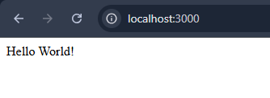
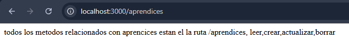
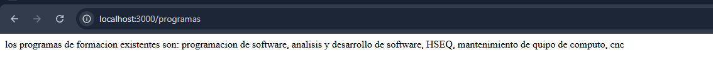
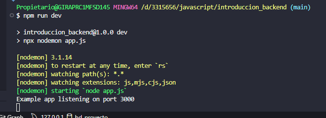

# 🚀 introduccion_backend

---

## ⚙️ Proceso de Configuración

> **¿Qué pasos realizaste desde la creación de la carpeta hasta la ejecución del servidor?**

1. `git clone https://github.com/Jhon-Gelvez/introduccion_backend.git`
2. `npm init -y`
3. `npm install express`
4. `npm i nodemon`
5. `npm i cors`
6. Actualizar el `package.json` a type modules y añadir el script dev
7. Configurar el servidor usando el código de ejemplo de express y permitir las peticiones con cors
8. `npm run dev`

---

> **¿Qué función cumple el archivo package.json?**

Este archivo contiene la configuración básica de nuestro proyecto como el nombre, versión, scripts y dependencias.

---

> **¿Qué ocurre al ejecutar npm install?**

Se instalan las dependencias en `package.json` y si no está la carpeta `node_modules` se crea.

---

## 🧠 Comprensión del Servidor

> **¿Qué significa que el servidor esté "escuchando" en un puerto?**

Significa que si recibe una petición a ese puerto él será capaz de recibirla, procesarla y enviar algún valor al cliente según sea necesario. Si se llama a un puerto en el cual el servidor no está escuchando nunca será capaz de recibir la petición del cliente.

---

> **¿Qué sucede internamente cuando accedes a http://localhost:3000/?**

El servidor está escuchando en ese puerto y tiene un endpoint dedicado para esa ruta (`/`), luego de recibir la petición envía una respuesta.

---

## 🔍 Análisis de Rutas

> **¿Qué diferencia existe entre cada ruta creada?**

Cada ruta es distinta `"/"`, `"/aprendices"`, `"/programas"` y responde con una información distinta, también tiene un `app.get` para cada ruta.

---

> **¿Qué papel cumplen los parámetros request y response?**

- **`request`**: es la información que envía el cliente, puede ser un json, texto u otro tipo de información.
- **`response`**: es la información que envía el servidor hacia el cliente, puede ser json, texto, archivos, imágenes u otro tipo de datos.

---

## 💡 Reflexión Técnica

> **¿Qué dificultades encontraste?**

1. Al realizar las peticiones desde el navegador respondía con error por origen cruzado.
2. Cada cambio que se realiza en el servidor no se actualiza por defecto, para solucionarlo se usa nodemon.
3. Al cambiar el type a modules en `package.json` también se debe corregir la importación de las librerías.

---

> **¿Qué aprendiste que no habías comprendido completamente en la parte teórica?**

No importa la posición del `app.listen`, si está al inicio o al final el servidor escucha y maneja las peticiones.

---

> **¿Por qué es importante estructurar bien un proyecto desde el inicio?**

Para no tener cambios de 180° a mitad del desarrollo y perder semanas enteras intentando descubrir qué hiciste en el pasado o uno de tus compañeros. Nos da una guía clara de todas las tareas grandes del desarrollo y cómo se deben hacer.

---

## 📸 Capturas de Pantalla

### `/`

### `/aprendices`

### `/programas`

### Proceso corriendo

---

## 🎯 Conclusiones

Con esta clase queda claro cómo es el funcionamiento completo del repositorio, cliente, servidor, cómo se interpretan por dentro las peticiones a la API y cómo de forma simplificada funcionan todas las páginas web.